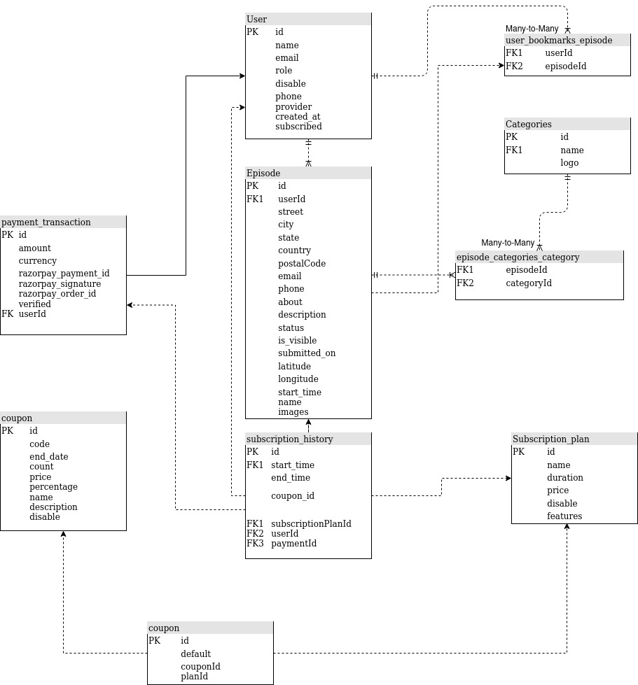

# speaker-ore-api

APIs for SpeakerOre

### Sections

-   Events
-   Payment
-   Subscription (with Coupons)
-   Auth
-   Uploads
-   Cronjobs

### Steps to run the server locally

1. clone this repo
2. `npm i` to install all the dependencies
3. Copy the contents of `.env.example` and create a new `.env` file with valid data
4. `npm run start:dev` to start the server

Database used for development is sqlite. Which should be switched to postgres when going live. Minor updates in `typeorm.config.ts` is necessary.

Images are uploaded to AWS S3 bucket.

### Things yet to be completed

1. Add events via excel sheet
    - Sheet upload code is written but not tested
2. Payment integration
    - Code complete but whole process should be tested
    - The access keys should be created newly
3. APIs related to User's transaction history
4. Email service integration

### Resources

1. [nestjs](https://docs.nestjs.com/)
2. [TypeORM](https://typeorm.io/)
3. [Razorpay integration](https://razorpay.com/docs/payment-gateway/web-integration/standard/)

### DB Schema

-   Find all the APIs created from the postman collection
-   Code follows a standard Controller/Service/Repository pattern. Please follow any good nestjs tutorials to understand the above
